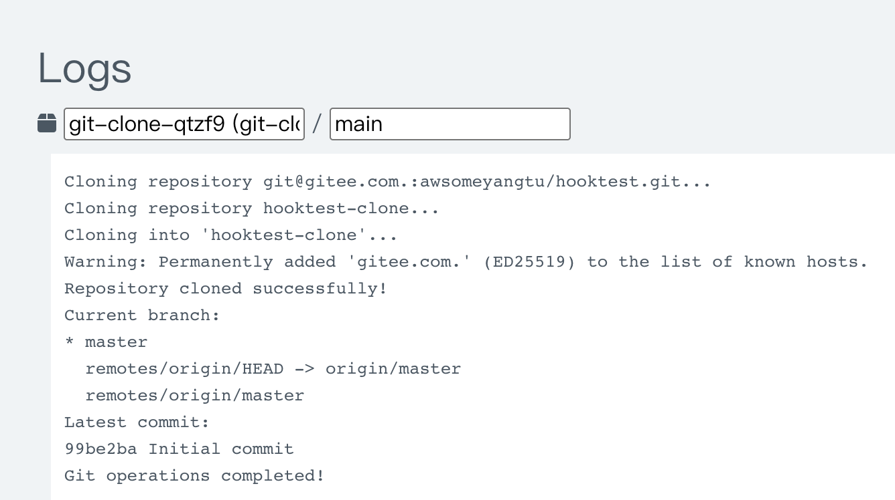

# 拉取git仓库

## 前置准备

由于github国内访问比较慢甚至访问不了，采用国内的gitee，请注册并创建一个测试用的仓库，本文采用的仓库是：https://gitee.com/awsomeyangtu/hooktest

创建一个秘钥对，公钥：id_rsa.pub，私钥：id_rsa，若已存在秘钥对可以不创建。我本地mac

```shell
ls ~/.ssh/
id_rsa		id_rsa.pub	known_hosts	known_hosts.old
```

将公钥id_rsa.pub的内容配置到gitee

## secret准备

在k8s容器中拉取Git仓库，正常情况下都是需要秘钥的，且无需确认就可以拉取，使用如下secret配置

```yml
# gitee-ssh-secret.yaml
apiVersion: v1
kind: Secret
metadata:
  name: gitee-ssh-secret
  # 如果你的 Argo 运行在特定命名空间，记得指定
  namespace: argo
type: Opaque
stringData:
  # 这里使用stringData避免base64编码的麻烦
  # 将你的私钥内容粘贴在这里
  id_rsa: |
    {你的私钥id_rsa的内容，贴进来的时候注意缩进格式}
    
  # SSH配置文件，StrictHostKeyChecking no是为了无需确认
  config: |
    Host gitee.com
        HostName gitee.com
        User git
        IdentityFile /root/.ssh/id_rsa
        StrictHostKeyChecking no
        UserKnownHostsFile /dev/null
```

在argo空间应用该secret

```shell
root@k8s-master:/home/seayang# kubectl apply -f gitee-ssh-secret.yaml -n argo
secret/gitee-ssh-secret created
```

## 拉取仓库

```yml
# git-sync.yaml
apiVersion: argoproj.io/v1alpha1
kind: Workflow
metadata:
  generateName: git-clone-
  namespace: argo  # 如果Argo安装在特定命名空间
spec:
  entrypoint: git-clone-task
  arguments:
    parameters:
      - name: git-repo-url
        value: "git@gitee.com.:awsomeyangtu/hooktest.git"
      - name: target-dir
        value: "my-repo"
  
  templates:
    - name: git-clone-task
      inputs:
        parameters:
          - name: git-repo-url
          - name: target-dir
      volumes:
        - name: ssh-volume
          secret:
            secretName: gitee-ssh-secret # 前面的secret名称
            defaultMode: 0600  # 设置正确的文件权限
      
      container:
        image: alpine/git:v2.49.1
        command: ["/bin/sh", "-c"]
        args:
          - |
            # 创建.ssh目录并设置正确权限
            mkdir -p /root/.ssh
            chmod 700 /root/.ssh
            
            # 从secret挂载点复制SSH文件到.ssh目录
            cp /secret/id_rsa /root/.ssh/
            cp /secret/config /root/.ssh/
            
            # 设置正确的文件权限（SSH严格要求）
            chmod 600 /root/.ssh/id_rsa
            chmod 644 /root/.ssh/config
            
            # 克隆仓库
            echo "Cloning repository {{inputs.parameters.git-repo-url}}..."
            git clone {{inputs.parameters.git-repo-url}} {{inputs.parameters.target-dir}}
            
            # 检查克隆结果
            cd {{inputs.parameters.target-dir}}
            echo "Repository cloned successfully!"
            echo "Current branch:"
            git branch -a
            echo "Latest commit:"
            git log --oneline -5
            
            echo "Git operations completed!"

            sleep 180
        volumeMounts:
          - name: ssh-volume
            mountPath: /secret
            readOnly: true
```

若终端输入argo version无效需要下载cli

```shell
# Download the binary
curl -sLO https://github.com/argoproj/argo-workflows/releases/download/v3.4.8/argo-linux-amd64.gz

# Unzip
gunzip argo-linux-amd64.gz

# Make binary executable
chmod +x argo-linux-amd64

# Move binary to path
mv ./argo-linux-amd64 /usr/local/bin/argo

# Test installation
argo version
```

在argo空间提交该工作流

```shell
argo submit git-sync.yaml \
  -p git-repo-url="git@gitee.com.:awsomeyangtu/hooktest.git" \
  -p target-dir="hooktest-clone"
```

在argo页面查看该工作流的日志输出



进入Pod验证仓库是否拉取成功

```shell
root@k8s-master:/home/seayang# kubectl get pods -n argo
NAME                                   READY   STATUS    RESTARTS   AGE
argo-server-c7d4d7f8b-4w52t            1/1     Running   0          3d2h
git-clone-qtzf9                        2/2     Running   0          4m50s
workflow-controller-8646cbc66f-9nxw6   1/1     Running   0          3d2h
root@k8s-master:/home/seayang# kubectl exec -it git-clone-qtzf9 -n argo -- sh
/git # ls
hooktest-clone
/git 
/git # ls hooktest-clone/
README.en.md  README.md
```

可以看出，拉取没问题
