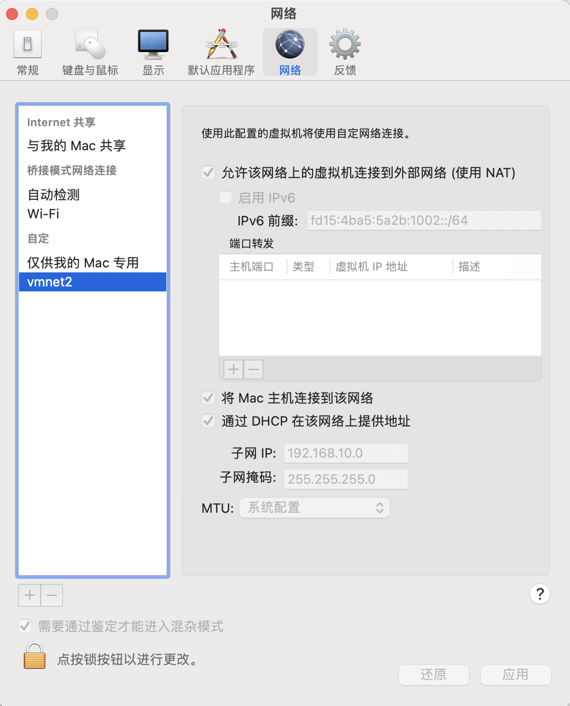
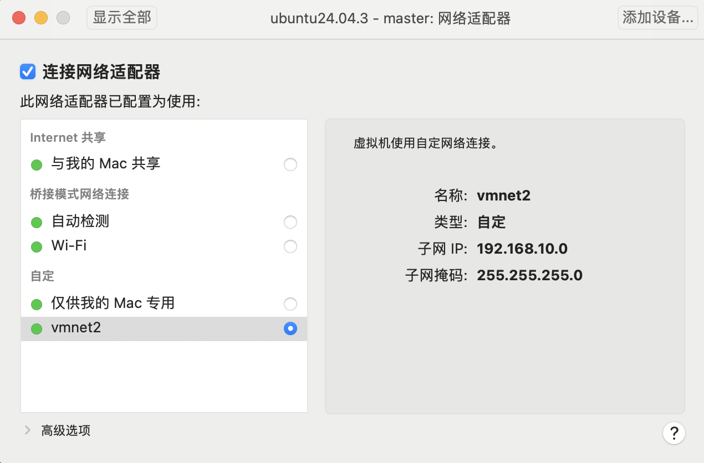

# k8s环境搭建

基于k8s 1.23.3版本，使用kubeadm搭建本地环境，这是一个比较老的版本，之所以选择该版本，是因为几年前学习的是该版本，且在该版本上玩过argo，简单起见继续基于该版本，后续再考虑搭建新版本玩

## 本地环境信息

- macbook pro 2018款，Intel芯片
- macOS 14.8.3
- VMvare Fusion 专业版 13.5.2
- Ubuntu 24.04.3 desktop master worker各一台，配置都是2c4g，50g磁盘（如果本地磁盘不是很充足，也建议至少40g，如果只有30g，我的经验是容易因磁盘空间不足发生pod驱逐）

虚拟机软件的安装以及安装Ubuntu虚拟机的过程请自行搜索，本文档只记录k8s 1.23.3的安装记录

需要注意的是，虚拟机master worker的主机名不能相同，若主机名相同，可编辑/etc/hostname来修改

另外，worker节点加入集群后别改主机名，否则可能会导致worker节点NotReady（这个笔者踩过坑）

```shell
root@k8s-master:/home/seayang# cat /etc/hostname
k8s-master
```

### 虚拟机网络设置

VMWare Fusion，点设置 - 网络，添加一个自定义网络，如下方的vmnet2，网段是“192.168.10.0”，允许使用 NAT 连接外网



然后在虚拟机的网络设置里选用这个网络



## 安装前准备

### ubuntu基础软件安装

```shell
sudo apt update
sudo apt install -y git vim curl jq
sudo apt install -y openssh-server
```

### docker安装

```shell
sudo apt install docker.io #安装Docker Engine
sudo service docker start #启动docker服务
sudo usermod -aG docker ${USER} #当前用户加入docker组
```

新开一个shell终端，验证docker安装是否成功

```shell
root@k8s-master:/home/seayang# docker version
Client:
 Version:           28.2.2
 API version:       1.50
 Go version:        go1.23.1
 Git commit:        28.2.2-0ubuntu1~24.04.1
 Built:             Wed Sep 10 14:16:39 2025
 OS/Arch:           linux/amd64
 Context:           default

Server:
 Engine:
  Version:          28.2.2
  API version:      1.50 (minimum version 1.24)
  Go version:       go1.23.1
  Git commit:       28.2.2-0ubuntu1~24.04.1
  Built:            Wed Sep 10 14:16:39 2025
  OS/Arch:          linux/amd64
  Experimental:     false
 containerd:
  Version:          1.7.28
  GitCommit:
 runc:
  Version:          1.3.3-0ubuntu1~24.04.3
  GitCommit:
 docker-init:
  Version:          0.19.0
  GitCommit:
```

### docker配置修改

把 cgroup 的驱动程序改成 systemd，然后重启docker

```shell
cat <<EOF | sudo tee /etc/docker/daemon.json
{
  "exec-opts": ["native.cgroupdriver=systemd"],
  "log-driver": "json-file",
  "log-opts": {
    "max-size": "100m"
  },
  "storage-driver": "overlay2"
}
EOF

sudo systemctl enable docker
sudo systemctl daemon-reload
sudo systemctl restart docker
```

### 启用br_netfilter

为了让 k8s 能够检查、转发网络流量，需要修改 iptables 的配置，启用br_netfilter模块

```shell
cat <<EOF | sudo tee /etc/modules-load.d/k8s.conf
br_netfilter
EOF

cat <<EOF | sudo tee /etc/sysctl.d/k8s.conf
net.bridge.bridge-nf-call-ip6tables = 1
net.bridge.bridge-nf-call-iptables = 1
net.ipv4.ip_forward=1 # better than modify /etc/sysctl.conf
EOF

sudo sysctl --system

# 加载内核模块
sudo modprobe br_netfilter

# 验证模块是否加载
lsmod | grep br_netfilter
```

### 关闭swap分区

修改“/etc/fstab”，关闭 Linux 的 swap 分区，提升 k8s 的性能

```shell
sudo swapoff -a
sudo sed -ri '/\sswap\s/s/^#?/#/' /etc/fstab
```

***注意，这些准备操作需要在每台虚拟机上执行***

## 安装 kubeadm

### 软件源设置

```shell
sudo apt install -y apt-transport-https ca-certificates curl

curl https://mirrors.aliyun.com/kubernetes/apt/doc/apt-key.gpg | sudo apt-key add -

cat <<EOF | sudo tee /etc/apt/sources.list.d/kubernetes.list
deb https://mirrors.aliyun.com/kubernetes/apt/ kubernetes-xenial main
EOF

sudo apt update
```

### 安装kubeadm、kubelet 和 kubectl

```shell
sudo apt install -y kubeadm=1.23.3-00 kubelet=1.23.3-00 kubectl=1.23.3-00
```

验证安装是否成功

```shell
root@k8s-master:/home/seayang# kubeadm version
kubeadm version: &version.Info{Major:"1", Minor:"23", GitVersion:"v1.23.3", GitCommit:"816c97ab8cff8a1c72eccca1026f7820e93e0d25", GitTreeState:"clean", BuildDate:"2022-01-25T21:24:08Z", GoVersion:"go1.17.6", Compiler:"gc", Platform:"linux/amd64"}
root@k8s-master:/home/seayang# kubectl version --client
Client Version: version.Info{Major:"1", Minor:"23", GitVersion:"v1.23.3", GitCommit:"816c97ab8cff8a1c72eccca1026f7820e93e0d25", GitTreeState:"clean", BuildDate:"2022-01-25T21:25:17Z", GoVersion:"go1.17.6", Compiler:"gc", Platform:"linux/amd64"}
```

锁定版本

```shell
sudo apt-mark hold kubeadm kubelet kubectl
```

## 下载 k8s 组件镜像

查看安装 Kubernetes 所需的镜像列表

```shell
root@k8s-master:/home/seayang# kubeadm config images list --kubernetes-version v1.23.3
k8s.gcr.io/kube-apiserver:v1.23.3
k8s.gcr.io/kube-controller-manager:v1.23.3
k8s.gcr.io/kube-scheduler:v1.23.3
k8s.gcr.io/kube-proxy:v1.23.3
k8s.gcr.io/pause:3.6
k8s.gcr.io/etcd:3.5.1-0
k8s.gcr.io/coredns/coredns:v1.8.6
```

走阿里镜像源，加速镜像下载

```shell
repo=registry.aliyuncs.com/google_containers

for name in `kubeadm config images list --kubernetes-version v1.23.3`; do

    src_name=${name#k8s.gcr.io/}
    src_name=${src_name#coredns/}

    docker pull $repo/$src_name

    docker tag $repo/$src_name $name
    docker rmi $repo/$src_name
done
```

***注意，这些镜像也需要在worker节点拉取***

## 安装 Master 节点

```shell
sudo kubeadm init \
    --pod-network-cidr=10.10.0.0/16 \
    --apiserver-advertise-address=192.168.10.128 \
    --kubernetes-version=v1.23.3
```

- --pod-network-cidr，设置集群里 Pod 的 IP 地址段
- 192.168.10.128是master虚拟机节点的ip地址

命令输出

```shell
Your Kubernetes control-plane has initialized successfully!

To start using your cluster, you need to run the following as a regular user:

  mkdir -p $HOME/.kube
  sudo cp -i /etc/kubernetes/admin.conf $HOME/.kube/config
  sudo chown $(id -u):$(id -g) $HOME/.kube/config

Alternatively, if you are the root user, you can run:

  export KUBECONFIG=/etc/kubernetes/admin.conf

You should now deploy a pod network to the cluster.
Run "kubectl apply -f [podnetwork].yaml" with one of the options listed at:
  https://kubernetes.io/docs/concepts/cluster-administration/addons/

Then you can join any number of worker nodes by running the following on each as root:

kubeadm join 192.168.10.128:6443 --token 0e15ua.8ilkx9d3lhc0mqvg \
    --discovery-token-ca-cert-hash sha256:5b278385f78be91e227374529480a1849ef3fddfe81bf70e7901fb1b48543fa2
```

输出里面的这块内容需要再执行下

```shell
To start using your cluster, you need to run the following as a regular user:

  mkdir -p $HOME/.kube
  sudo cp -i /etc/kubernetes/admin.conf $HOME/.kube/config
  sudo chown $(id -u):$(id -g) $HOME/.kube/config
```

这个命令是给k8s worker节点加入集群使用的，后续会用到

```shell
kubeadm join 192.168.10.128:6443 --token 0e15ua.8ilkx9d3lhc0mqvg \
    --discovery-token-ca-cert-hash sha256:5b278385f78be91e227374529480a1849ef3fddfe81bf70e7901fb1b48543fa2
```

查看集群状态

```shell
root@k8s-master:/home/seayang# kubectl version
Client Version: version.Info{Major:"1", Minor:"23", GitVersion:"v1.23.3", GitCommit:"816c97ab8cff8a1c72eccca1026f7820e93e0d25", GitTreeState:"clean", BuildDate:"2022-01-25T21:25:17Z", GoVersion:"go1.17.6", Compiler:"gc", Platform:"linux/amd64"}
Server Version: version.Info{Major:"1", Minor:"23", GitVersion:"v1.23.3", GitCommit:"816c97ab8cff8a1c72eccca1026f7820e93e0d25", GitTreeState:"clean", BuildDate:"2022-01-25T21:19:12Z", GoVersion:"go1.17.6", Compiler:"gc", Platform:"linux/amd64"}
root@k8s-master:/home/seayang# kubectl get node
NAME                 STATUS     ROLES                  AGE     VERSION
k8s-master           NotReady      control-plane,master   2d21h   v1.23.3
```

可以看出Master节点的状态是NotReady，这是由于还缺少网络插件，集群的内部网络还没有正常运作。

## 安装Flannel网络插件

下载[flannel.yml](./yml/flannel.yml)，也可以到github搜索flannel，下载其它版本的yml

需要修改文件里的“net-conf.json”字段，把 Network 改成刚才 kubeadm 的参数 --pod-network-cidr 设置的地址段

```yml
  net-conf.json: |
    {
      "Network": "10.10.0.0/16",
      "Backend": {
        "Type": "vxlan"
      }
    }
```

flannel.yml文件保存到master节点，然后执行

```shell
kubectl apply -f flannel.yml
```

flannel成功运行之后，再查看k8s节点状态，发现master节点变为Ready状态了

```shell
root@k8s-master:/home/seayang# kubectl get nodes
NAME                 STATUS     ROLES                  AGE     VERSION
k8s-master           Ready      control-plane,master   2d21h   v1.23.3
```

## 安装Worker节点

安装必要软件、安装docker、拉取k8s组件镜像等上述已经描述了，照做即可

### 加入集群

前面在master节点初始化集群，输出一段文本，文本最后是一个加入集群的命令，需要在每个worker节点上执行，命令如下

```shell
kubeadm join 192.168.10.128:6443 --token 0e15ua.8ilkx9d3lhc0mqvg \
    --discovery-token-ca-cert-hash sha256:5b278385f78be91e227374529480a1849ef3fddfe81bf70e7901fb1b48543fa2
```

在master查看集群状态

```shell
root@k8s-master:/home/seayang# kubectl get nodes
NAME                 STATUS   ROLES                  AGE     VERSION
k8s-master           Ready    control-plane,master   2d23h   v1.23.3
seayang-k8s-worker   Ready    <none>                 2d22h   v1.23.3
```

可以看到两个节点都处于Ready状态

## 参考资料

- https://time.geekbang.org/column/article/534762
